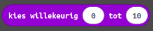

# Microbit

De Microbit is een zogenaamd Printed circuit board (PCB). Een electronisch plaatje met verschillende onderdelen zoals LEDs, knoppen en sensoren. Deze kun je programmeren met je telefoon, je tablet of je computer. Gedurende de eerste weken gaan we aan de slag met deze micro computer. Je leert hiermee de basis van programmeren. Je mag zelf kiezen of je dit wilt doen met [makecode](https://makecode.microbit.org/#editor) blocks (grafische code aan elkaar slepen) of met tekstueel programmeren (in JavaScript of Python). 

Als eerste ga je de microbit aansluiten aan je computer om te kijken of je connectie hebt. Sluit de USB kabel aan op je microbit en je laptop. Als het goed is wordt de microbit direct herkend door je computer. Je kunt vanuit Google Chrome code direct op de microbit downloaden/flashen. Als dit niet lukt wordt er een .hex bestandje gedownload wat je vanuit je download map naar de microbit kunt slepen met de verkenner. 

[Troubleshooting connectie](FAQ.md)

## Basis: Opdracht 1a

Je kunt de microbit als led tekstbalk gebruiken. De tekst scrollt dan van rechts naar links over de 5x5 led matrix. Je gebruikt hiervoor het basis blok "Toon tekens". De tekst in het witte invoerveld kun je zelf aanpassen.

Sleep het blok naar "Bij opstarten". Flash het stukje code nu op je microbit en kijk wat er gebeurd.

Sleep nu het blok uit "Bij opstarten" en sleep het in "De hele tijd". Flash de code nu opnieuw naar je microbit. Zie je verschil?

Je kunt ook meerdere van deze "Toon tekens" blokken achter elkaar zetten. Probeer dit eens en kijk wat er gebeurd.

Een goede oefening is om af en toe te kijken hoe blokken programmeren vertaald naar tekst programmeren. Verwissel de schuif bovenin je scherm naar JavaScript of naar Python. 

Als je programmeert met tekst commando's zijn deze vrijwel altijd in het Engels. De meeste programmeurs krijgen op den duur een voorkeur voor een programmeertaal. Door naar de verschillen te kijken, kun je zelf ook kijken wat jij een makkelijkere of leukere programmeertaal vindt. 

## Basis: Opdracht 1b

We gaan nu door met de volgende opdracht. We gaan nu icoontjes op de 5x5 led matrix weergeven. Je hebt hierin 2 opties. Of je kiest voor het blok "Toon pictogram" of "Toon lichtjes". In "Toon pictogram" heb je de keuze uit een aantal standaard icoontjes, maar je kunt ze ook zelf maken. 

Sleep de "Toon tekens" richting prullebak (naar de tabbladen). Plaats vervolgens het blok naar keuze naar "Bij opstarten". Flash je code naar de microbit. Schuif na het uitvoeren van de code, het blokje naar "De hele tijd". Zie je nu nog verschil?

Ga door met de volgende opdracht.

## Knoppen: Opdracht 2

Zoals je al hebt kunnen zien zitten er op de microbit 3 knoppen. A, B en een reset knop. De A en B knop zit voorop en kunnen we gebruiken om mee te programmeren.

Er zijn verschillende manieren om de knoppen te programmeren. Start eerst een nieuwe project en sleep de blauwe blokken naar de prullebak (in het midden van de tabbladen). Kijk vervolgens bij het tabblad "Invoer" en sleep het blok "Wanneer de knop A wordt ingedrukt" naar het programmeerveld. 

Doe dit een tweede keer en verander hiervan de A in een B. Vervolgens kun je zelf het programma afmaken door verschillende icoontjes te laten verschijnen als je knop A of knop B indrukt, of andere tekst te laten verschijnen. Of iets wat je zelf bedacht hebt.

We gaan nu een andere variant van het programma maken. Hiervoor gebruiken we een stukje logica. Je kiest hiervoor eerst het basis blok "De hele tijd". Volgens kies je uit het tabblad "Logica" het blok "Als ... dan". Je kunt nu uit het tabblad "Invoer" het blok "Knop A wordt ingedrukt" met de hoeken in het "Als ... dan" blok slepen. Dit doe je nog een keer vanaf het logica blok maar nu vul je B in. Vervolgens maak je het programma verder af zoals je vorige programma. 

Als je het programma nu naar je microbit flasht zie je als het goed is geen verschil. Programmeurs hebben dit vaak. Er zijn verschillende manieren om hetzelfde te bereiken. In de komende periode zul je dit vaak meemaken. Raak dan dus niet in paniek.

Het voordeel van het logica blok is dat je meerdere als dan blokken kunt gebruiken. Je kunt zo'n blok bijvoorbeeld ook uitklappen om aan te geven wat er moet gebeuren als er geen knop wordt ingedrukt. Je kunt de leds dan bijvoorbeeld leeg laten. 

## Variabelen: Opdracht 3

We gaan nu een paar dingen combineren en een nieuw soort blok introduceren. We gebruiken straks de knoppen. Je mag zelf beslissen in welke vorm je dat doet, vanuit de startblokken, of met de logica. Nu maken we een apparaatje waarmee je bezoekers kunt tellen. Je drukt steeds op knop A om de teller op te hogen als er iemand naar binnen gaat en op knop B als er iemand weggaat.

Variabelen hebben meestal een logische naam zoals teller, getal of nummer. Soms gebruiken programmeurs ook slechts 1 letter zoals i of x. Voor nu maakt het niet uit. Klik op het tabblad "Variabelen" en klik "Maak variabelen". Geef je variabelen een naam. Bijvoorbeeld teller of in het Engels counter. 

Als het programma start dan stel je de variable in op 0, er zijn dan nog geen bezoekers binnen. Wordt er op knop A gedrukt dan verander je de variabele met + 1. Wordt er op knop B gedrukt dan veranderd te variabelen met - 1. We willen in ieder geval dat de hele tijd de variabele op het scherm getoond wordt. 

In de tekst staan voldoende tips over welke blokken je kunt gebruiken. Flash het programma als je klaar bent weer naar je microbit om te testen of het werkt zoals je wilt. 

## Sensoren: Opdracht 4a

Op de microbit zitten een aantal ingebouwde sensoren, zoals een accelerometer. Dit is een sensor die beweging of snelheid detecteerd. Deze sensor kun je bijvoorbeeld gebruiken om een schud beweging te detecteren. Zo kun je bijvoorbeeld je stappen meten als je de microbit aan je schoen vast maakt. Voor nu gaan we een dobbelsteen maken.

Start een nieuw project en sleep de blauwe begin blokken weg uit het veld. Net zoals bij de knoppen opdracht kijk je bij het "Invoer" tabblad naar het blok "Bij schudden".

We willen een willekeurig/random getal kiezen. Hiervoor moeten we een variabele aanmaken. Maak nu opnieuw een variable aan en geef deze een naam, zoals getal.

Sleep daarna het blok "Stel getal in op 0" tussen "bij schudden".

We willen de variabelen niet op 0 laten staan, maar we willen iedere keer als we de microbit schudden een willekeurig getal kiezen tussen 1 en 6. Daarvoor gebruiken we uit het "Rekenen" tabblad het blok "Kies willekeurig 0 tot 10". Dit sleep je op de plek van de 0.

De 0 en de 10 van het "Kies willekeurig" blok pas je aan.

Nu gaan we de laatste logica toevoegen. In programma's wordt heel vaak gebruik gemaakt van als-dan combinaties. Als iets waar is dan voeren we dat uit. Hier doen we dat ook. Als getal 0 is dan, anders als getal 1 is dan, anders als getal 2 is dan, etc. 

Probeer zo het programma af te maken en flash het naar je microbit. Als je de microbit schud dan zie je het getal veranderen. Als je wilt kun je in plaats van toon nummer ook het blok "Toon lichtjes" gebruiken voor een echt dobbelsteen effect. 

Vergeet ook niet om nog eens bij de Python of JavaScript code te kijken.

Kom je er echt helemaal niet uit? Dan is hier een [Hint](Antwoord_Dobbelsteeen.md)

## Sensoren: Opdracht 4b

We gaan nu aan de slag met de kompas sensor. De kompassensor geeft een  waarde graden. Het gaat dan om het aantal graden vanuit het magnetisch noorden. Teken op een blaadje een cirkel en bepaal vanuit daar welke voorwaarden moet gebruiken om het noorden, oosten, zuiden en westen te bepalen. 

Vertaal nu wat je hebt getekend naar code. Het programma lijkt een beetje op de vorige opdracht. Je kunt het invoer blok "Kompasrichting" direct in je voorwaarden in het logische blok gebruiken.

Flash de code naar je microbit en bepaal het noorden van het lokaal.

## Sensoren: Opdacht 4c 

De microbit kan lichtsterkte meten. Dus of het donker of licht is in de kamer. We kunnen de microbit op deze manier als een soort zaklampje gebruiken. Als het donker is, moeten de leds meer schijnen dan wanneer het licht is.

Soortgelijk als bij de vorige opdracht werken we weer met voorwaarden "Als ... dan" en "Anders als ... dan". Als invoer blok gebruiken we "Lichtniveau". 

Het lichtniveau gaat van waarde 0 tot waarde 255 (Dit heeft iets te maken met bits en bytes. Hier komen we later in het jaar op terug). Hoe feller het licht hoe hoger de waarde. 

Er zijn 2 manieren om de microbit te programmeren om meer licht te geven. Bij de ene zet je meer leds aan. Als de omgeving licht is dan laat je maar 1 ledje in de 5x5 matrix branden. Als het donker is zet je ze allemaal aan. Maar de andere manier is om de leds letterlijk harder of zachter te laten branden. Je gebruikt hiervoor het blok "Stel helderheid in op ..." Voordat het "Toon lichtjes" blok gebruikt. Je vindt dat blok onder de drie puntjes onder het tabblad "Lichtjes".

Speel eens met de verschillende varianten en kies welke jij het mooist vindt op je microbit. 

---

# Extra opdrachten

Je hebt nu kennis gemaakt met de meeste van de Microbit onderdelen op de chip. Er zijn nog meer mogelijkheden met de Microbit, zoals een multiplayer game te maken, geheime communicatie of misschien wil je de micro computer wel uitbreiden met extra onderdelen of speciale add ons. Hieronder staan wat ideeen, maar je mag ook je eigen project bedenken en uitvoeren. 

## Radio communicatie

### Hoger lager

### Morse

## Microbit uitbreiden met de pins

## Microbit spel maken met een gamecontroller